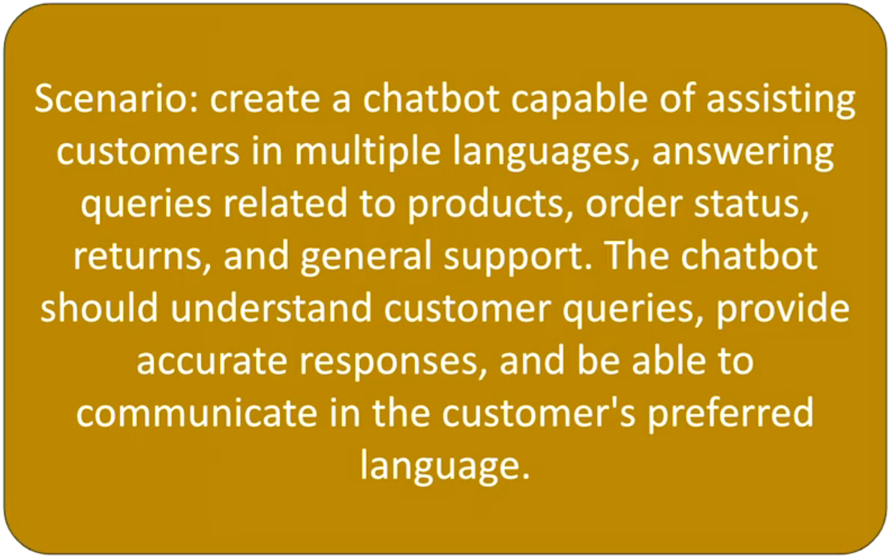
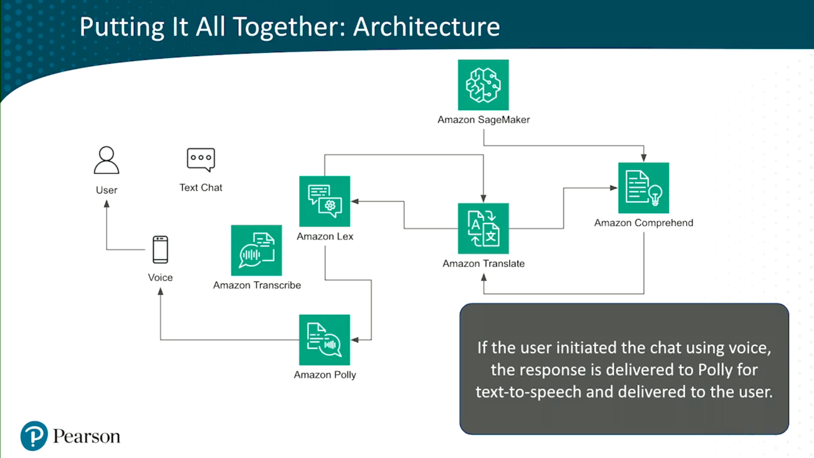

# AWS AI and ML Services

## SageMaker

1. Managed service
2. Allows Build, Train, Deploy ML models
3. Provides IDE access
4. Provides no-code interfaces
5. Scalable

## Transcribe

1. Extracts insights from audio, video, and text
2. Provides domain-specific models for accuracy
3. Data masking

## Translate

1. NPL translation
2. Batch and real-time
3. Allows to put unique terms

## Comprehend

1. Extracts insights from documents and large texts
2. Identifies keywords, phrases and emotions from the text
3. Callifies documents and texts out-of-the box

## Lex

1. Chat-bot! service
2. A mediator between the user and the backend service
3. Voice and text conversational tone

## Polly

1. TTS (Text-to-Speech) service

## Task

