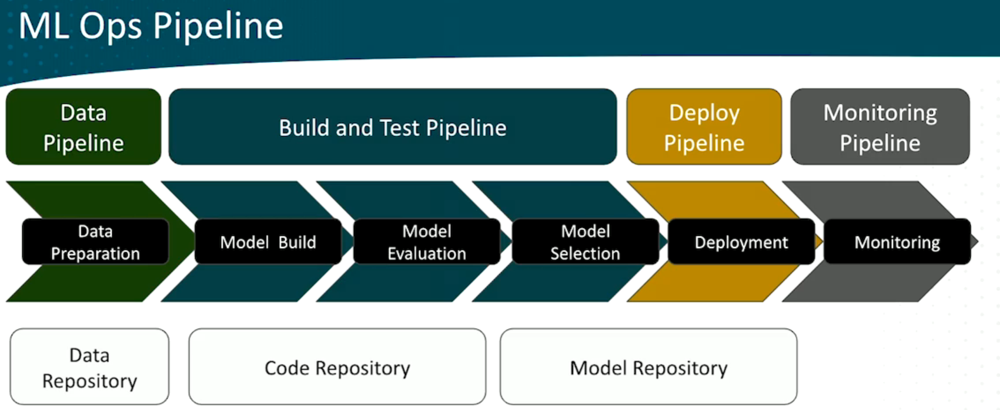

# ML SDLC

## Lifecycle

1. Define Business Goal
   1. Is ML the appropriate technology for the challenge?
   2. Workflow:
        Business Consideration -> Frame the ML problem -> Determine the optimization objective -> Review data requrements -> Cost and performance optimization -> Prodcution considerations
2. ML Problem Framing
   1. Identify inputs and outputs
   2. Identify depentent and independent variables
3. Collect Data
   1. Labeling
   2. Ingestions (real-time (streaming), batch)
   3. Data aggregation
4. MLOps pipeline
   1. Pre-process the data
      1. Clean data
      2. Partition data
      3. Scale data
      4. Balancing data
      5. Augmenting data
   2. Feature Engineering
      1. Feature - input for a model
   3. Train, Tune, Evaluate
   4. Deployment
   5. Monitoring

## ML Model Sources

1. Open-source pre-trained models from
   1. Meta
   2. Hugging Face
   3. TensorFlow
2. Custom model
   1. built-in model
   2. different learning algorithms

## MLOps

1. Version Control
   1. Data
   2. Code
   3. Models
2. Automation
3. CI/CD (Deployment)
4. Model Covernance
   1. Fairness
   2. Bias

### Benefits of MLOps

1. Productivity
2. Reliablity (because of automation)
3. Repearability
4. Auditability (all is versioned, process can be evaluated from end to end)
5. Data/Model Quality (guardrails and model validation automation)

## Detailed MLOps Pipeline

