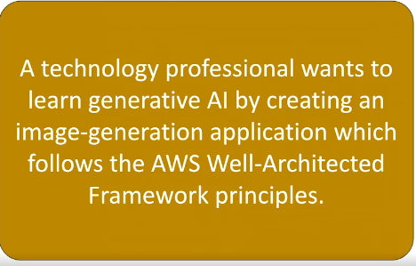
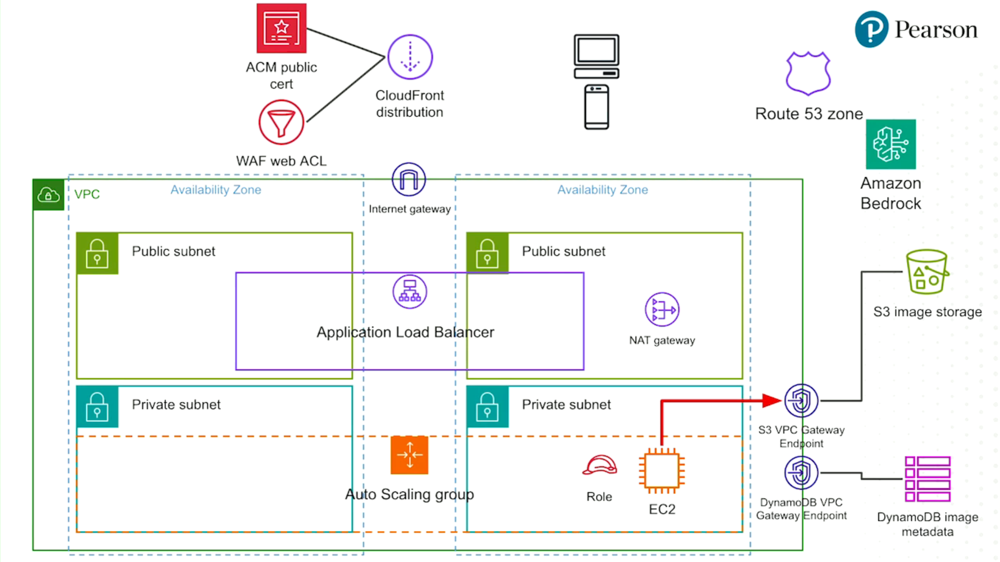

# Generative AI Use Case

## Problem Description

### Requirements

- Managed model hosting (NOT self-hosting)
- Resilient Infrastructure (NOT serverless)
- Use managed services for image storage and metadata persistence

## Solution

### Elaboration

1. Network: Public and Private Networks, deployed over 2 Avalilability Zones, NAT Gateway for Outbound traffic for Public Subnets
2. Application Load Balancer and Auto Scaling group, consists of EC2 instances and assigned to them Roles
3. CDN in CloudFront: Used for Application Load Balancer (ALB) and the content of the Images of the models
4. CDN has Wildcard certification applied to, Web Application Firewall (WAF) web Access List (ACL) that verifies the requests
5. Route 53 for DNS lookout
6. Backend: Amazon Bedrock - self-hosted model for image generation, S3 image storage - store images and presenting them to the users, DynamoDB - for images metadata. S3 and DynamoDB both have Endpoints from the VPC network, so EC2 cannot go outside the Internet Gateway to communicate with them
7. The End User communicates with Route 53, and landed to CloudFront distribution
8. The request from the End User is reverse-proxied from CloudFront Distribution to the Internet Gateway, and to the ALB, and then reverse-proxied to the EC2 instance, to perform the work
9. EC2 instance sends its request through NAT gateway, and Internet Gateway to the Amazon Bedrock, to generate the image according to the prompt. It's two-way communication. The Response from Bedrock contains the Base64 encoded image with the metadata
10. EC2 places the Bedrock unencoded response in the following manner: The metadata is placed to the DynamoDB, the image itself is placed to a S3 bucket
11. The end user gets back the S3 URL of the image, which can be reached through the CloudFront Distribution
