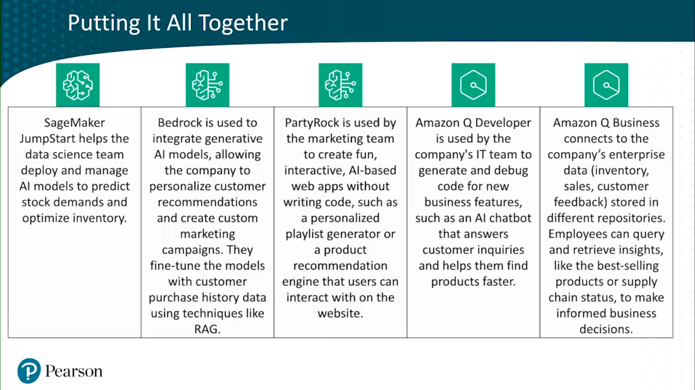

# AWS Gen AI

## AWS Gen AI Services

1. SageMaker JumpStart
   1. Pre-trained models for text/image generation
   2. Models can be customized with the user's features and deployed via UI or SDK
   3. Models and Notebooks are shared within organizations
   4. Data stays encrypted within a VPC
2. Amazon Bedrock
   1. High-performing models from AI companies
   2. Models can be customized with the user's features and/or (Retrieval-Augmented Generation) RAG
   3. Serverless
   4. Integrated with AWS Services
3. Amazon Bedrock PartyRock
   1. Playground for GenAI apps
   2. No-code automation
   3. Helps to learn the GenAI functions, provides foundational models and a playground for them
4. Amazon Q
   1. Aims on helping with software development and leverage company data
   2. Q Developer - for devs assistance, Q Business for Business Intelligence (BI) tasks
   3. Generates code, answers question and works with other business tools
   4. QuickSight visualization helps creating AI apps

### Summary

