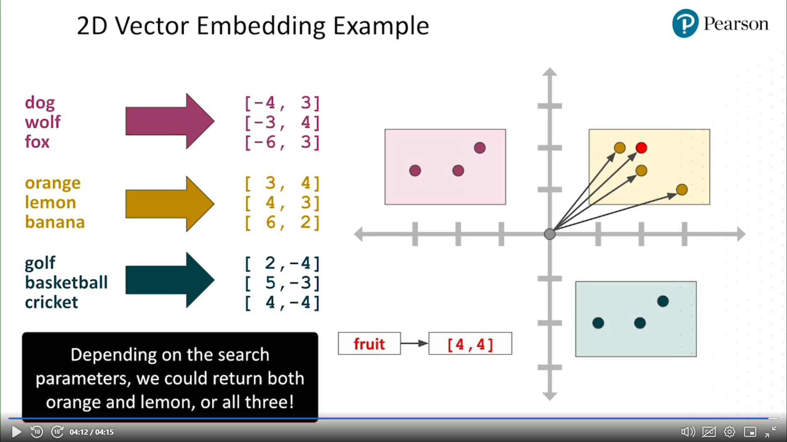

# Foundation Models

## Design Requirements

1. Mid-sized model
2. Moderately complex model
3. Text-based model
4. Multi-lingual model
5. Low latency model
6. Customizable model

## Model Inference Parameters

1. Temperature - likeliness of selecting input-based outputs. Low value - more deterministic, High value - more diversity
2. Top K - number of candidate tokens considered for output. Low value - more most likely outputs, High value - fewer most likely outputs
3. Top P - percentage of candidate tokens considered for output. Low value - less diversity, High value - more diversity
4. Output Length - value, represents, a min or max, number of tokens to return in the response. It has Penalties:
   1. Response Lenght
   2. Repeated Token
   3. Token Frequency
   4. Token Type

### Example

Prompt: "The sky is filled with"

Candidates: stars (0.6), clouds (0.3), dragons (0.1)

Outputs variations:

1. Temperature == High: Output = Dragons (increased creativity)
2. Top K == 3: Output = stars, clouds, dragons (all three outputs are included)
3. Top P == 0.8: Output = stars and clouds are likely, dragons a chance

## Retrieval Augmented Generation (RAG)

RAG is a process of augmenting LLM output by referencing a knowledge base, which is outside the context of LLM training sources

### Implementation

1. Traditional Database or Indexing System (ElasticSearch) - keyword search
2. Vector Database (basic implementation) - similarties (chunk) search
3. Hybrid Knowledge Base - combination of keyword and similarities searches, in parallel, the search is ranked
4. Vector + Graph Database - vector-based chunk search extended with graph-linked relevant chunks
5. Direct Model Integration - not a RAG anymore, as it fine-tunes the model, by including the context, rather than passing it with the prompt

### RAG Business Applications

1. Intelligent question-answering systems (Chat-bots)
2. Enriching the existing knowledge bases (good for repharasing the information)
3. Generating high-quality content (good for summaries, reports and similar things)

### Benefits

1. Enhanced Accuracy
2. LLM Contextual Relevance
3. Improved Handling of Specific Verticals (easy to use the topic documents)

### Challanges

1. Pipeline Complexity (as it includes source communication)
2. Latency Issues (as it includes source communication)
3. Dependence on the Quality of the Retrieval Set
4. Resource Requirements
5. Difficulty of Tuning and Maintanence

## Vector Database

**Vector Database** is a data storage system designed for efficient storing, indexing, retrieval of high-dimentional vector representation of unstructured data (vector embeddings), enabling similarities search

**Vector Embeddings** is a numberical representation of chunks (data points) in a vector, capturing semantic relationships and similarities among the data. They ease maching learning and information retrieval tasks

**Document Chunking** is a process of braking down large piece of document/text into smaller pieces, chunks. Chunks contain tokens. Chunk size and overlap are critical model metrics

### Example

words (chunks)|vectors|graph
-|-|-
dog|[-4,3]|
wolf|[-3,4]|
fox|[-6,3]|
-|-|-
orange|[3,4]|
lemon|[4,3]|
banana|[6,2]|
-|-|-
golf|[2,-4]|
basketball|[5,-3]|
cricket|[4,-4]|

## AWS Vector Database Service

1. Amazon OpenSearch
   1. Real-time search
   2. Open-source OpenSearch managed service
   3. Server-based and serverless options
   4. Generates embeddings externally
   5. Stores and searches vector embeddings
2. Amazon Aurora (for Postgres)
   1. Cloud-native Relational database service
   2. Postgres managed service
   3. Server-based and serverless options
   4. Stores and searches vector embeddings
   5. Uses pgvector (postgres utility)
3. Amazon RDS (for Postgres)
   1. PaaS Relational database service
   2. Postgres managed service
   3. Server-based option only
   4. Stores and searches vector embeddings
   5. Uses pgvector (postgres utility)
4. Amazon Neptune
   1. NoSQL Graph databased service
   2. Gremlin and SPARQL query options
   3. Server-based and serverless options
   4. Stores and searches vector embeddings
5. Amazon DocumentDB
   1. NoSQL document store service
   2. MongoDB compatibility
   3. Server-based option only
   4. Stores and searches vector embeddings
