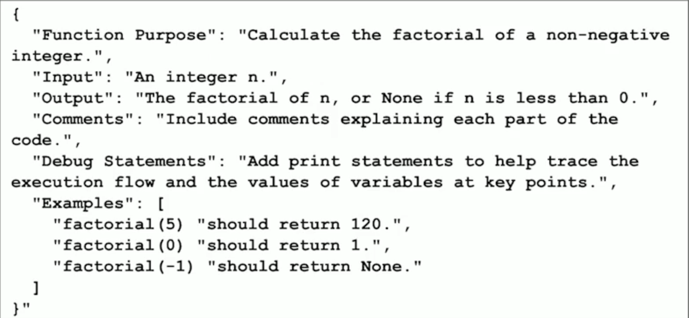

# Prompt Engineering

Prompt Engineering is a process of designing and refining input prompts to optimize the performance of AI models

## Prompt Workflow

### Prompt Elements

1. System message - the role to be assumed by LLM in generating response
2. User message - the user input
3. Assistant message - tone and format of the response
4. Contextual data - a contextual source to be included while generating a response
5. Model bias - it overrides any prompt instructions

### The Workflow

User -> User message -> Contextual Data -> Model Bias -> System message -> Assistant message -> User

## Key Components

1. Context - information surrounding the prompt, for the context. Previous message is included as a context to the next message
2. Instruction - specific task or question for the model
3. Negative Prompts - instructions that specify what the model should avoid or exclude in its repsonse

### Crafting Effective Instructions

1. Clarity - be direct cand clear
2. Specifity - avoid ambiguity
3. Brevity - consice

### Negative Prompts

1. Definition: instuction for the model what to avoid
2. Purpose: helps refine responses and prevent unwanted content
3. Example: "don't include personal opninions" or "avoid using technical jargon"

## Techniques

1. Zero-Shot Prompt
   1. Example: "Write a Python function to calculate the factorial of a number"
2. Single-shot Prompt
   1. Example: "Create a Python function named factorial that calculates the factorial of a non-negative integer. For example, factorial(5) should return 120 and factorial(0) should return 1. If input is less than 0, it should return None"
3. Few-shot Prompt
   1. provide a couple of example of the Python code
   2. provide the prompt itself from point 2
4. Chain-of-Thought Prompt
   1. Clearly state the task: "I want to write a Python function that calculates the factorial of a given number"
   2. Break down the task: "The factorial of a number n (denotes as n!) is the product of all positive integers less than or equal to n. For example, 5! = 5 * 4 * 3 * 2 * 1 = 120. The function should handle edge cases such as when n=0 or n<0. If n is less than 0, the function should return None. If there is an existing library to calculate factorial, please use it"
   3. Provide examples: "For example, if I call the function with n=5, it should return 120. If I call it with n=0, it should return 1"
5. Prompt Templates - predefined structures for prompts that can be filled with variable data
   1. using a template like 

## Best Practicies

1. Response Quality - create a clear and specific prompt. Not "Tell me about climate change", but "Explain the main causes of climate change and its impact on global sea levels"
2. Experiment - Not "Summarize the attached financial report", but "Summarize all financial statements in the attached financial report" OR "Identify and return all metrics that contribute to EBITDA in the attached financial report"
3. Establish Guardrails - guidance for AI repsonse. Example prompt: "In 200 words or less, summarize the key challenges for Kubernetes adoption. Only consider technology challenges"
4. Discovery - effictive prompt leads to unexcpected insights. Example prompt: "In how many ways is it possible to score in American Football?"
5. Specifity and Concision. Not "Describe technology", but "Describe the impact of AI on healthcare in 100 words"
6. Multiple Comments - breaking down complex queries into multiple parts to improve clarity. Not "What are the economic impacts and social effects of remote work?", but "What are the economic impacts of remote work?" AND "What are the social effects of remote work?"

## Risks and Limitations

1. Exposure - sensitive engineering may lack
2. Poisoning - intentional model's training data or inputs manipulation to induce harmful behaviour
3. Hijacking - prompt exploiting to take control over output, which can be harmful or misleading
4. Jailbreaking - the process of bypassing safety protocols and limitations that prevents AI from generating inappropriate content

### Risks Mitigation

1. Use robust AI safety protocols and content moderation systems
2. Regularly audit and test models against potential vulnerabilities
3. Establish guidelines for ethical AI use and clear definition of harmful prompts
